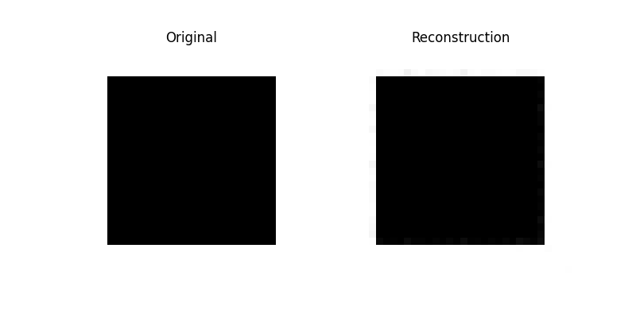
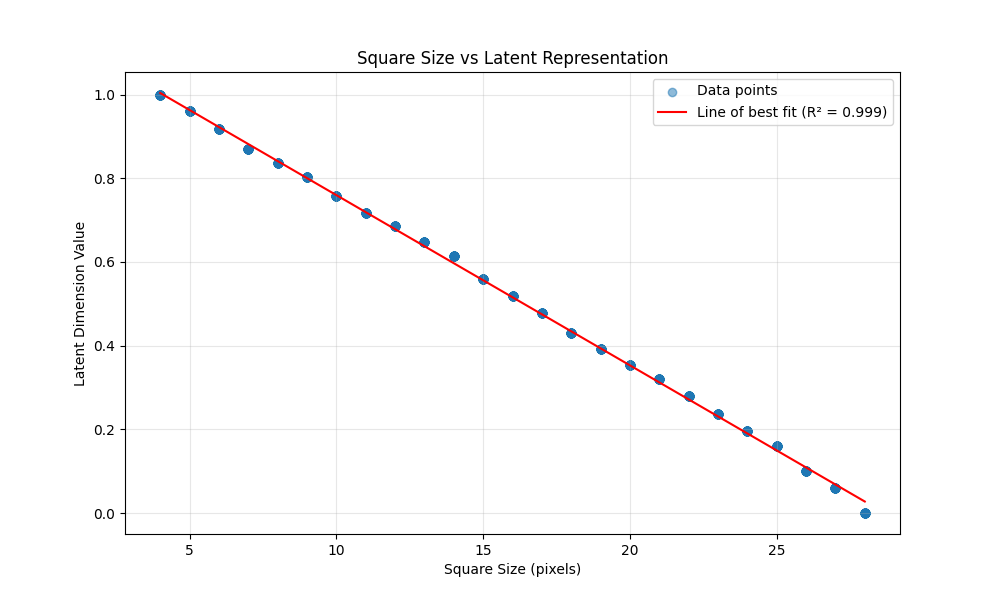

# Square Image Autoencoder

This project demonstrates that a simple geometric property (square size) can be effectively encoded into a single latent dimension using a convolutional autoencoder. We generate a dataset of 32x32 black and white images containing centered squares of varying sizes and show that the autoencoder learns to compress this information into a single continuous value.

## Architecture

### Dataset
- 1000 black and white images (32x32 pixels)
- Each image contains a black square centered in the image
- Square sizes vary randomly between 4 and 28 pixels

### Autoencoder Network

#### Encoder
```
Input Image (1x32x32)
↓
Conv2d(1→16, 3x3, stride=2, padding=1) + ReLU  # 16x16x16
↓
Conv2d(16→32, 3x3, stride=2, padding=1) + ReLU  # 32x8x8
↓
Conv2d(32→64, 3x3, stride=2, padding=1) + ReLU  # 64x4x4
↓
Flatten
↓
Linear(1024→1)
↓
Sigmoid (normalizes output to [0,1])
```

#### Decoder
```
Linear(1→1024)
↓
ReLU
↓
Reshape to (64x4x4)
↓
ConvTranspose2d(64→32, 3x3, stride=2, padding=1) + ReLU  # 32x8x8
↓
ConvTranspose2d(32→16, 3x3, stride=2, padding=1) + ReLU  # 16x16x16
↓
ConvTranspose2d(16→1, 3x3, stride=2, padding=1) + Sigmoid  # 1x32x32
```

## Verification of Single Latent Dimension

We verify that a single latent dimension is sufficient through several methods:

1. **Perfect Reconstruction**: The autoencoder achieves very low reconstruction loss, indicating that all necessary information is preserved in the latent space. Below are sample reconstructions at different training epochs:



2. **Linear Correlation**: We plot the relationship between square sizes and their latent representations, showing a strong linear correlation:



This demonstrates that:
   - The latent space has learned a meaningful representation
   - There's a one-to-one mapping between square sizes and latent values
   - The relationship is monotonic (larger squares consistently map to different latent values than smaller squares)

3. **Continuous Interpolation**: By interpolating between latent values and decoding them, we observe smooth transitions between different square sizes, indicating the latent space has learned a continuous representation of the geometric property.

## Usage

1. Install dependencies:
```bash
pip install -r requirements.txt
```

2. Generate the dataset:
```bash
python generate_dataset.py
```

3. Train the autoencoder:
```bash
python train.py
```

The training script will:
- Train for 100 epochs
- Save reconstruction samples every 5 epochs
- Generate a scatter plot showing the relationship between square sizes and their latent representations
- Save the trained model as 'square_autoencoder.pth'

## Results

The scatter plot above shows:
- X-axis: Original square sizes (4-28 pixels)
- Y-axis: Encoded latent values (0-1)
- Each point represents one image from the dataset
- The line of best fit demonstrates the strong linear relationship between square size and latent representation

The reconstruction samples show:
- Left: Original image
- Right: Reconstructed image from the 1D latent space

These results confirm that our autoencoder successfully compresses the square size information into a single continuous value while maintaining the ability to accurately reconstruct the original images. 