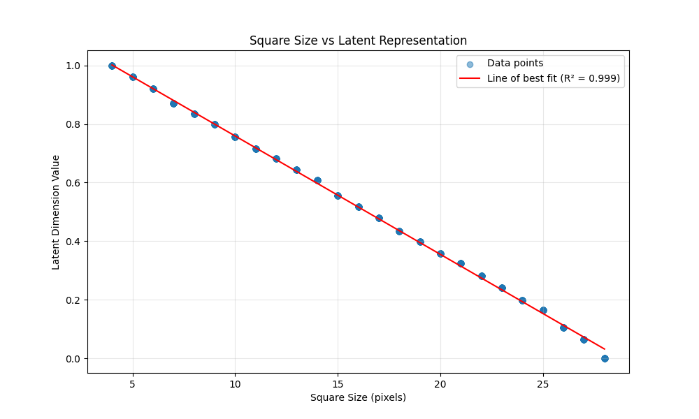

# Understanding Autoencoders and Latent Spaces

## Lesson 1: Latent Representation of Centered Square.

Our first experiment is to see if we can create a 1-value latent representation centered squares. We generate a dataset of 32x32 black and white images containing centered squares of varying sizes: therefore, the only information needed to encode this image is 1 value (the square size length.)

We will show that these images can be effectively encoded into a single latent dimension using a convolutional autoencoder with spatial attention.

### Architecture

#### Dataset
- 1000 black and white images (32x32 pixels)
- Each image contains a black square centered in the image
- Square sizes vary randomly between 4 and 28 pixels

#### Autoencoder Network

##### Encoder
```
Input Image (1x32x32)
↓
Conv2d(1→16, 3x3, stride=1, padding=1) + BatchNorm + ReLU + SpatialAttention  # 16x32x32
↓
Conv2d(16→32, 3x3, stride=2, padding=1) + BatchNorm + ReLU + SpatialAttention  # 32x16x16
↓
Flatten
↓
Linear(32*16*16 → 1)
↓
Sigmoid (normalizes output to [0,1])
```

##### Decoder
```
Linear(1 → 32*16*16)
↓
ReLU
↓
Reshape to (32x16x16)
↓
ConvTranspose2d(32→16, 3x3, stride=2, padding=1, output_padding=1) + BatchNorm + ReLU + SpatialAttention  # 16x32x32
↓
Conv2d(16→1, 3x3, stride=1, padding=1) + Sigmoid  # 1x32x32
```

##### Spatial Attention Mechanism
The spatial attention mechanism helps the model focus on the relevant parts of the image:
```
Input Feature Map
↓
Conv2d(in_channels→1, kernel_size=1)  # Creates attention map
↓
Sigmoid  # Normalizes attention weights to [0,1]
↓
Element-wise multiplication with input  # Applies attention
```

### Results

We use MSE for our loss function between the original and reconstructed image. After 100 epochs, our loss is close to 0:
- Epoch [100/100], Average Loss: 0.0000

These results confirm that our autoencoder successfully compresses the square size information into a single continuous value while maintaining the ability to accurately reconstruct the original images. 

### Verification of Single Latent Dimension

We verify that a single latent dimension is sufficient through several methods:

1. **Accurate Reconstruction**: The autoencoder achieves very low reconstruction loss, indicating that all necessary information is preserved in the latent space. Below are sample reconstructions at different training epochs: The reconstruction sample shows:
- Left: Original image
- Right: Reconstructed image from the 1D latent space


2. **Linear Correlation**: We plot the relationship between square sizes and their latent representations, showing a strong linear correlation: The scatter plot below shows:
- X-axis: Original square sizes (4-28 pixels)
- Y-axis: Encoded latent values (0-1)
- Each point represents one batch from the dataset
- The line of best fit demonstrates the strong linear relationship between square size and latent representation



This demonstrates that:
   - The latent space has learned a meaningful representation
   - There's a one-to-one mapping between square sizes and latent values
   - The relationship is monotonic (larger squares consistently map to different latent values than smaller squares)

### Usage

1. Install dependencies:
```bash
pip install -r requirements.txt
```

2. Generate the dataset:
```bash
python generate_dataset.py
```

3. Train the autoencoder:
```bash
python train.py
```

The training script will:
- Train for 100 epochs
- Save reconstruction samples every 5 epochs
- Generate a scatter plot showing the relationship between square sizes and their latent representations
- Save the trained model as 'square_autoencoder.pth'


## Lesson 2: Latent Representation of Squares in Various Positions

Our second experiment explores whether we can create a latent representation for squares that vary in both size and position. We generate a dataset of 32x32 black and white images containing squares of varying sizes at different positions, with a 2-pixel margin from the edges.

We will show that these images can be effectively encoded using a convolutional autoencoder with spatial attention, and we'll analyze how different latent dimensions affect the reconstruction quality. Theoretically, we should only need 3 latent values to represent the image (x,y position of bottom left corner, and side length).

### Architecture

#### Dataset
- 2048 black and white images (32x32 pixels)
- Each image contains a black square at a random position
- Square sizes vary randomly between 4 and 24 pixels
- Squares maintain a 2-pixel margin from the image edges

#### Autoencoder Network
We used the same architecture as lesson 1.

### Results

We use MSE for our loss function between the original and reconstructed image. The comparison plot shows:
- X-axis: Training epochs
- Y-axis: Average reconstruction loss
- Different lines represent models with different latent dimensions


The results confirm our theoretical expectation that 3 latent dimensions are sufficient to encode the position and size information:

This demonstrates that:
- Lower latent dimensions of 1 and 2 struggle to accurately encode the images
- There's a critical threshold at 3 dimensions, matching our theoretical expectation
- Beyond 3 dimensions, there are diminishing returns in improvement

These findings suggest that encoding requires about 3 dimensions, which aligns with the theoretical minimum needed to represent the x-position, y-position, and size of the square.

### Usage

1. Install dependencies:
```bash
pip install -r requirements.txt
```

2. Generate the dataset:
```bash
python generate_dataset.py
```

3. Train the autoencoder:
```bash
python train_variable_location.py
```

4. Evaluate performance of different latent dimension sizes 1,2,3,4,5.
```bash
python evaluate.py
```